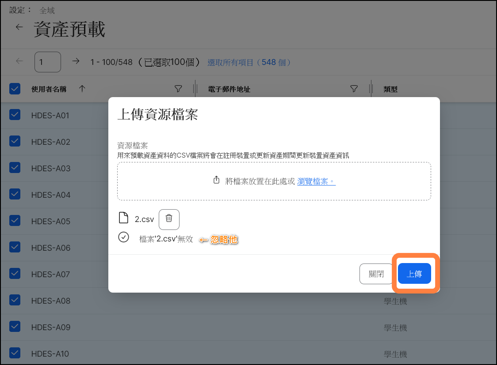

# 資產預載

[← 返回首頁](./)

在裝置重置，進行 PreStage 註冊後，iPad 裝置可以透過資產預載設定裝置名稱、使用者名稱，就不用再手動設定

操作說明可參考官方說明文件[資產預載](https://learn.jamf.com/zh-TW/bundle/jamf-pro-documentation-current/page/Inventory_Preload.html)，或是 Jamf 講師的[教學影片](https://www.youtube.com/watch?v=MxMk9mVJFbw)

以下是簡要說明：

1. 先到 Jamf `設定` → `全域` → `資產預載`匯出範本，如果有原有的資產，可以選取所有項目再匯出

2. 用 Excel 開啟空白活頁簿，點選上方的`資料`頁籤，點選`從文字/CSV`匯入，檔案原點選擇 `65001: Unicode(UTF-8)`，點選`載入`

3. 點選上方的`表格設計`頁籤，取消勾選標題列，再把標題列移除

* 進行資料更新，裝置資料更新規則如下：
  * 如果裝置序號相同，會以上傳的 .csv 檔覆蓋原有的資料，如果沒有此裝置序號就新增裝置
  * 如果裝置使用者名稱相同，會以上傳的 .csv 檔覆蓋原有的資料，如果沒有此使用者名稱就新增使用者
  * 資料更新完畢後，選擇另存新檔，檔案類型選擇 `CSV UTF-8(逗號分割)`

4. 到 Jamf `設定` → `全域` → `資產預載`中進行檔案上傳，會出現"檔案無效"的訊息，忽略此訊息直接上傳，即可完成資產預載更新

