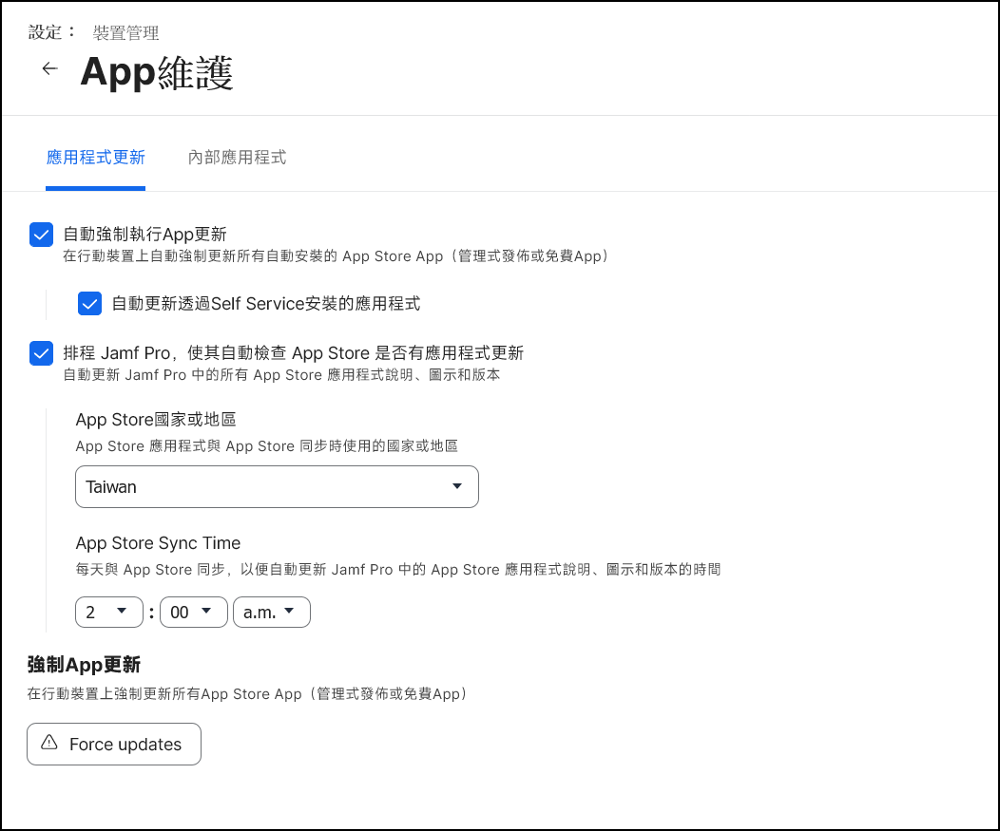
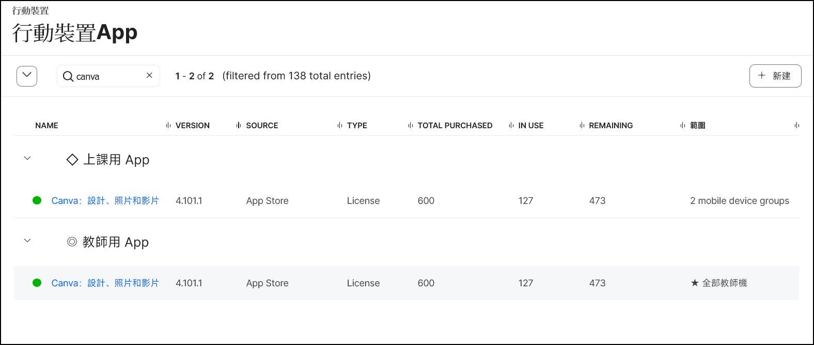
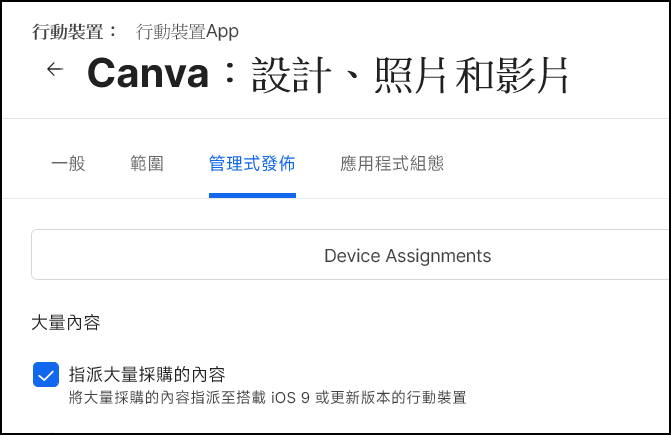

# 行動裝置 App

[← 返回首頁](./)

## 設定軟體自動更新時間

* 請到 `設定` → 上方`裝置管理`頁籤 → `App 維護`，勾選以下選項：
  * ✅ 自動強制執行 App 更新
    * ✅ 自動更新透過 Self Service 安裝的應用程式
  * ✅ 排程 Jamf Pro，使其自動檢查 App Store 是否有應用程式更新
    * App Store 國家或地區請選 `Taiwan`
    * App Store Sync Time 可自行設定同步時間，建議設定為網路離峰時間
* `Force updates` 可以強制 App 更新

  

## 如何讓上課需要的 App 在教師機手動安裝、學生機自動安裝？

* 這樣設定的好處是教師可以自行安裝或試用 App，學校只要控管學生機安裝 App，設定步驟如下：

  1. 在行動裝置 App 中，右上角 `新增` → 輸入 App 名稱，國家或地區選 `Taiwan`，新增一個同名的 App 到系統中

  2. 二個 App 分開設定：

  * 一個指派範圍給教師機，發佈方法為 `Make Avaiable in Self Service`，讓老師從 Self Service 中自行安裝

  * 另一個指派範圍給學生機，發佈方法為 `Install Automatically/Prompt Users to Install`，學生機就會自動安裝

    

  * App 設定都要勾選 `管理式發佈` → `✅ 指派大量採購的內容`

    