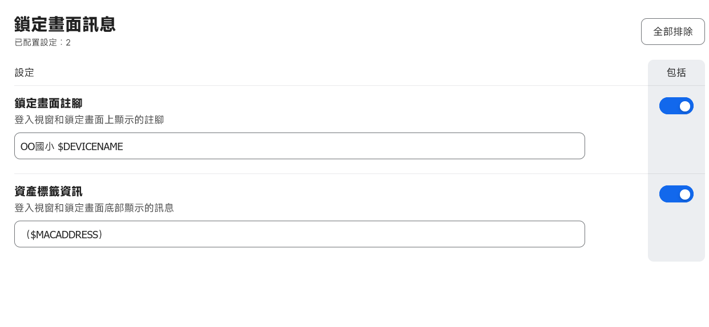

# 設定描述檔 > 鎖定畫面訊息

[← 返回首頁](../)

* 設定鎖定畫面時出現的訊息，會以 `鎖定畫面註腳` + `資產標籤資訊` 的方式出現，變數可以參考 Jamf 官方文件[設定描述檔的承載資料變數](https://learn.jamf.com/r/zh-TW/jamf-pro-documentation-current/Payload_Variables_for_iOS_Configuration_Profiles)來設定

* 請注意，承載變數區會區分大小寫

    
