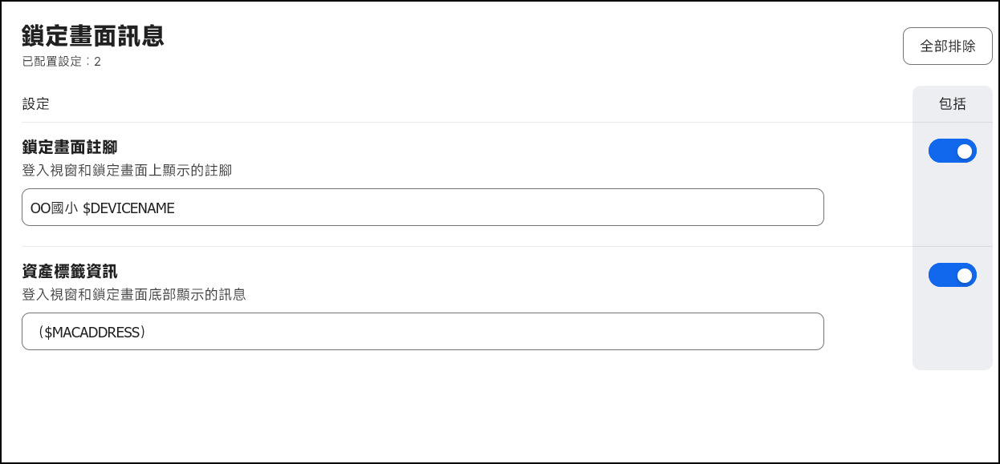

# 設定描述檔 > 鎖定畫面訊息

[← 返回首頁](../)

## 使用說明

* 設定鎖定畫面時出現的訊息，會以 `鎖定畫面註腳` + `資產標籤資訊` 的方式出現，變數可以參考 Jamf 官方文件[設定描述檔的承載資料變數](https://learn.jamf.com/zh-TW/bundle/jamf-pro-documentation-current/page/Mobile_Device_Configuration_Profiles.html#ariaid-title3)來設定

